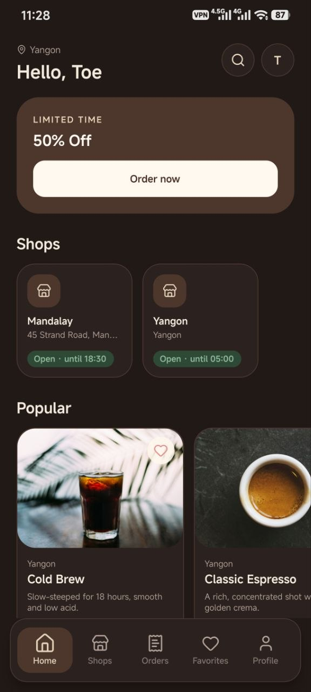
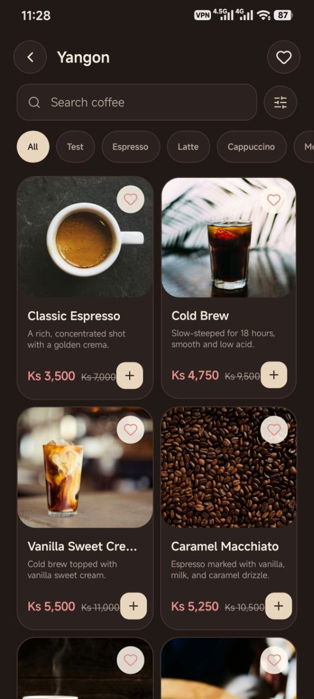
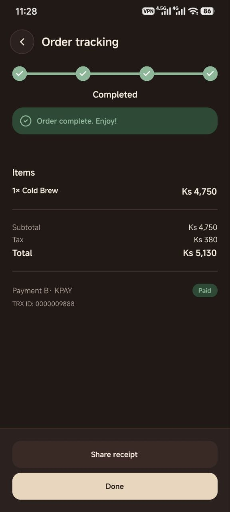
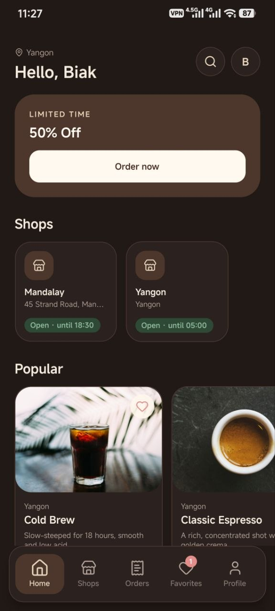
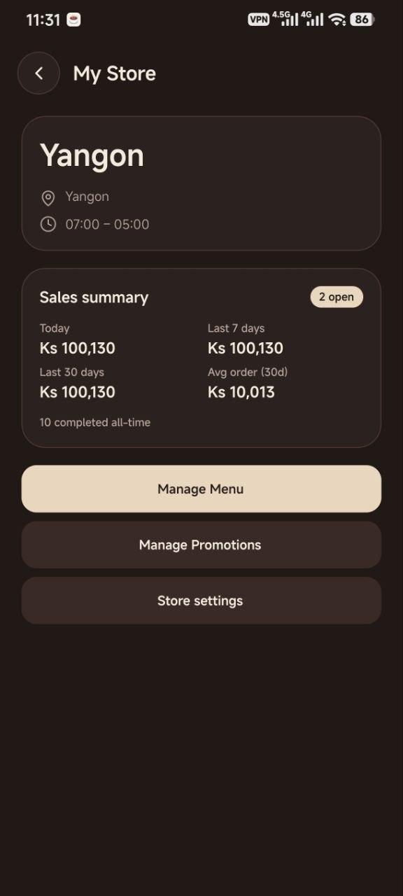
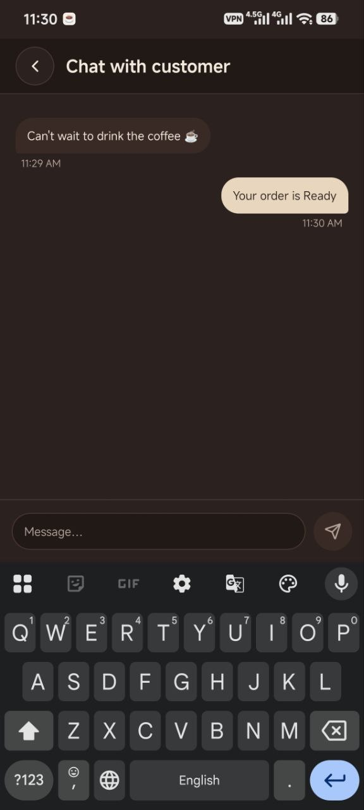
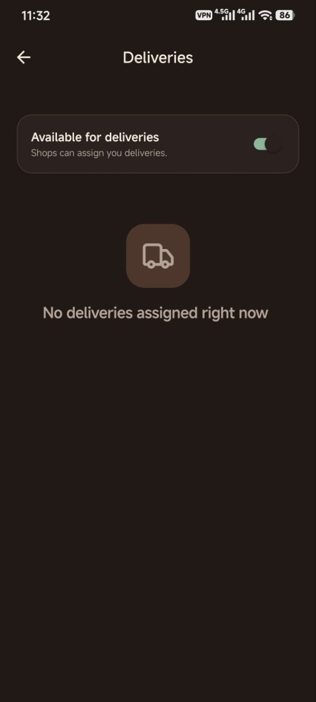
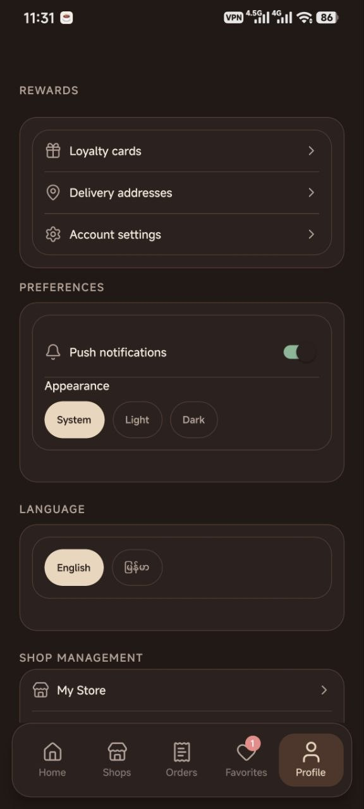
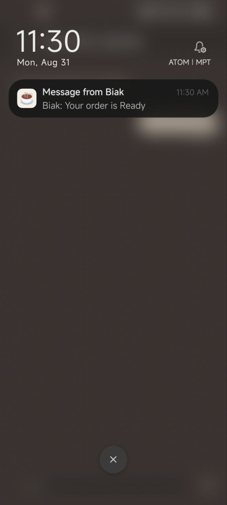

# Brewly (grab-coffee)

Coffee ordering for Myanmar: **customers order, sellers run their shop, drivers deliver**. Built with **Expo SDK 57 • React Native • Expo Router • Supabase • TypeScript (strict)**.

<p align="center">
  
  
  
</p>

## 📸 Screenshots

| Home | Home: Near you | Shop details |
|---|---|---|
|  |  |  |

| Store (seller) | Order tracking | Order chat |
|---|---|---|
|  |  |  |

| Deliveries (driver) | Profile | Notifications |
|---|---|---|
|  |  |  |

> All images live in [`docs/images/`](docs/images/), add more and they auto-show here.

## 🧩 Tech stack

* **App:** Expo SDK 57, React Native, Expo Router (file-based `src/app/**`), TypeScript strict (`tsc --noEmit`)
* **Backend:** Supabase Postgres + Auth + Realtime + Edge Functions (Deno): `src/services/supabase.ts`
* **State:** Zustand (`src/stores/`: auth/cart/network/toast), TanStack Query for server state, `react-hook-form + zod` (`zodResolver`)
* **UI:** `useTheme()` tokens (`colors/spacing/radius/typography`), `lucide-react-native`, primitives in `src/components/ui/` (`FieldInput`, `Button`, `BottomSheet`, `IconButton`)
* **Other:** `expo-location` (MapLink), `expo-notifications` (push), `expo-image-picker`, `i18n`

## Features

* **Customers**: browse shops/menus, customize drinks, cart, checkout with KPay/MMQR proof or cash, promo codes, loyalty stamps, pickup/delivery, order tracking + status timeline, per-order chat (shop → driver after assignment), push notifications, favorites, search, address book with MapLink pin, EN+MY.
* **Sellers**: store profile (location pin + hours), menu + option management, promotions with voucher scoping (`all/category/coffee`), order queue + payment verification, earnings summary.
* **Drivers**: `Become a Driver`, availability toggle, assigned deliveries, `driver_assigned → out_for_delivery → delivered → completed`, `Open in Google Maps` (coords-aware), customer chat.

## 🚀 Preview build

`eas.json` already has:

```json
{ "build": { "preview": { "distribution": "internal" } } }
```

**Cloud preview (share with friends):**

```bash
# one-time: expose Supabase vars to EAS ( .env is gitignored )
eas secret:create --scope project --name EXPO_PUBLIC_SUPABASE_URL --value https://wiscnurivaskypxuldjz.supabase.co
eas secret:create --scope project --name EXPO_PUBLIC_SUPABASE_ANON_KEY --value <anon>
# add SENTRY_DSN if you use it

# build a shareable APK (internal)
eas build --profile preview --platform android
# iOS needs Apple Dev; Android preview is enough
```

Find the install link on `expo.dev → Builds`. Share it, no store review. `DevAccountSwitcher` is `__DEV__` gated so it **won’t** appear in the preview; testers sign up as `customer` / `Become a Seller` / `Become a Driver` with real emails. For OTA fixes after sharing: `eas update --branch preview`.

**Local preview build:**

```bash
eas build --profile preview --platform android --local
```

## Getting started (local dev)

**Prereqs:** Node 20+, npm, Supabase project. Native modules → use a dev build (Expo Go not enough for push).

1. Install:
   ```sh
   npm install
   ```
2. Env, create `.env` from `.env.example`:
   ```
   EXPO_PUBLIC_SUPABASE_URL=https://wiscnurivaskypxuldjz.supabase.co
   EXPO_PUBLIC_SUPABASE_ANON_KEY=...
   EXPO_PUBLIC_SENTRY_DSN=...
   ```
3. DB:
   ```sh
   npx supabase link --project-ref wiscnurivaskypxuldjz
   npx supabase db push          # supabase/migrations/
   ```
4. Edge function (push):
   ```sh
   npx supabase functions deploy send-order-notification
   # secrets in Supabase dashboard, not .env
   ```
5. Run:
   ```sh
   npm run android   # or ios / npm start
   # single-device dev quick-switch: Profile → DEV · Quick switch (edit src/config/devAccounts.ts)
   ```

## Scripts

| Command | What it does |
|---|---|
| `npm start` | Expo dev server |
| `npm run android` / `npm run ios` | Native dev build and run |
| `npm run typecheck` | `tsc --noEmit`: run before committing |
| `npm run lint` | `expo lint` |
| `npm test` | Jest (`src/tests/**`, `src/**/*.test.ts(x)`) |
| `npm run web` | Web dev server (static) |

## Architecture

* `src/app/**`, Expo Router screens; `src/app/(tabs)/` tab bar, `src/app/(driver)/` driver stack
* `src/features/<domain>/`, domain logic (components/hooks/api) composed by screens
* `src/services/`, Supabase clients (`orders`, `stores`, `addresses`, `loyalty`, `promotions`, `chat`, `supabase`)
* `src/stores/`, Zustand (auth/cart/network/toast/language/notifications)
* `src/components/ui/`, primitives (`FieldInput` reanimated, `Button`, `BottomSheet`, `IconButton`, `Toast`)
* `src/theme/`, design tokens via `useTheme()`
* `src/i18n/`, `react-i18next`, `src/i18n/locales/{en,my}.json`
* `supabase/migrations/`, schema + RLS + `SECURITY DEFINER` RPCs (`create_order`, `update_order_status`, `assign_driver`, `get_coffee_options`)
* `supabase/functions/`, Deno edge functions (`send-order-notification`)
* `scripts/`, generators (notification icon, i18n helper)

## Payments

Manual proof only (no gateway): `kpay`/`mmqr` → buyer pastes transaction ID in `KpayPanel` (`src/features/checkout/components/KpayPanel.tsx`) → `attachPayment(orderId, method, ref)`. `cash` needs no proof. See `src/app/checkout.tsx` + `src/services/orders.ts` (`placeOrder`, `DELIVERY_FEE`, `delivery_lat/lng`).

## Conventions

Path alias `@/*` → `src/*`, inline `useTheme()` styles (no Tailwind), `formatCurrency` (`src/utils/currency`), `track()` analytics (`src/lib/analytics`), services throw human `Error`s surfaced via toast. See [AGENTS.md](AGENTS.md).
